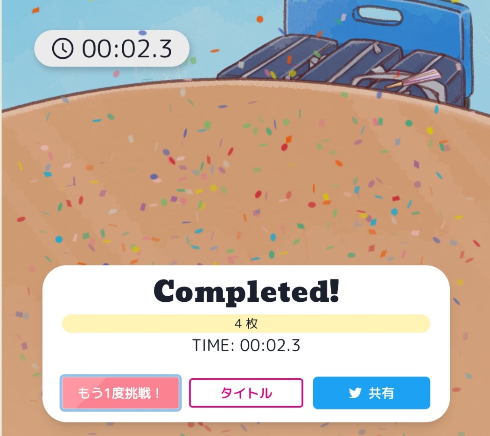

import EmbeddedTweet from "../../../src/components/EmbeddedTweet"

[LoveLive!Days ラブライブ！総合マガジン](http://gs.dengeki.com/lovelive-magazine/)の連載企画「広がれ虹の WA！虹ヶ咲学園スクールアイドル同好会　テーマ別活動」内で IT 活用チームがリリースしたミニゲームの開発・背景音楽のお手伝いをさせて頂きました。

このミニゲームは、名前の通り、虹ヶ咲のメンバーが描かれたカードを使って行う神経衰弱です。
めくった時の爽快感、テンポよく繰り返し遊べるルール、可愛らしいイラスト・音楽の雰囲気...と、プログラミングが得意な璃奈ちゃん、ゲームが大好きなせつ菜ちゃん、進捗管理が得意な栞子ちゃんのこだわりが詰まったミニゲームです。

ちなみに、成功時の紙吹雪は 虹ヶ咲のメンバーカラー(12 色)で構成されていて、気分を盛り上げてくれます。

イラスト: 凪乃しずくさん ([@s1zu9](https://twitter.com/s1zu9))  
プロップデザイン: さんざしさん([@xxsanzashixx](https://twitter.com/xxsanzashixx))
